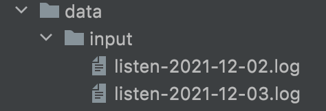
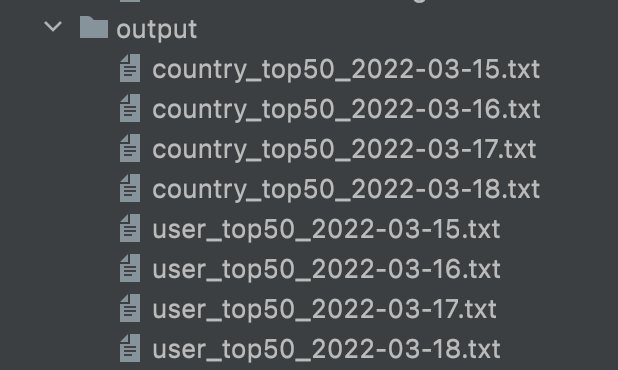

### Features

- Generate report for top50 songs listened per day in respective country
- Generate report for top50 songs listened by user per day
- Logger has been implemented, any exception will be logged in `app.log` file
- Test cases has been added for all functions

### How to Run

1. Install used packages as

```shell
pip install -r requirements.txt
```

2. Run Application

```shell
python run.py -t "user_top_50" ## to generate user's top 50 songs
python run.py -t "country_top_50_song" ## to generate country top 50 songs
```

### Run Test Cases

```shell
pytest
```

### Input

Input file is expected to be as inside directory `data/input/`



### Output

Output will be generated inside directory `data/output` as



### Benchmark

|   | Feature                   | Number of Records | Multiprocessing | Multithreading | Tested Machine                                                                 |
|---|---------------------------|-------------------|-----------------|----------------|--------------------------------------------------------------------------------|
| 1 | country wise top 50 songs | 1999998           | ~8 Sec          | ~34 Sec        | MacBook Pro Processor 2.2GHz Quad-Core Intel Core i7 Memory 16GM 1600 MHz DDR3 |
| 2 | user wise top 50 songs    | 1999998           | ~9 Sec          | ~34 Sec        | MacBook Pro Processor 2.2GHz Quad-Core Intel Core i7 Memory 16GM 1600 MHz DDR3 |

### Improvement
Counting of the country and user's top 50 songs can be done in single pass which will take less time in comparison with doing individually. However, I have treated as individual feature.  
